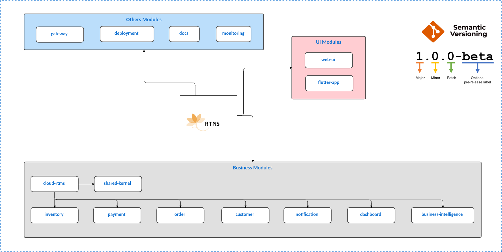

= Cloud RTMS: Hand-on Workshop in Microservices
Bhuwan Prasad Upadhyay <bot.bhuwan@gmail.com>
:favicon: images/favicon.png
:doctype: book
:icons: font
:source-highlighter: highlightjs
:toc: left
:toclevels: 3
:imagesdir:
:sectlinks:
:sectanchors:
:numbered: ''
:docinfo:

.RTMS Overview

.Welcome to the **Cloud RTMS: Hand-on Workshop in Microservices**.

== Introduction

. Business Domain

.Modules landscape for **Cloud RTMS**

== Feedback

If you have further feedback for this workshop, suggestions for improvements or you want me to
conduct this workshop somewhere else please do not hesitate to contact me via

* Mail: bot.bhuwan@gmail.com
* Twitter: https://twitter.com/IAmVuwan[@IAmVuwan]
* LinkedIn: https://www.linkedin.com/in/developerbhuwan[developerbhuwan]

Thank YOU very much for being part of this workshop :-)

[bibliography]
== References

* https://docs.spring.io/spring-boot/docs/current/reference/htmlsingle/[Spring Boot Reference Documentation]

[appendix]
== Copyright and License

Copyright (C) 2020 by {author}. +
Free use of this software is granted under the terms of the Apache 2.0 License.
